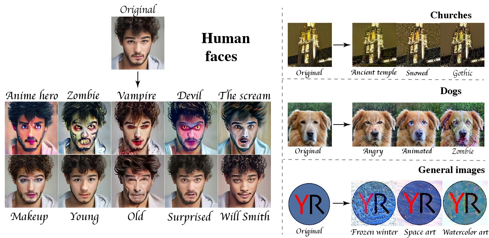
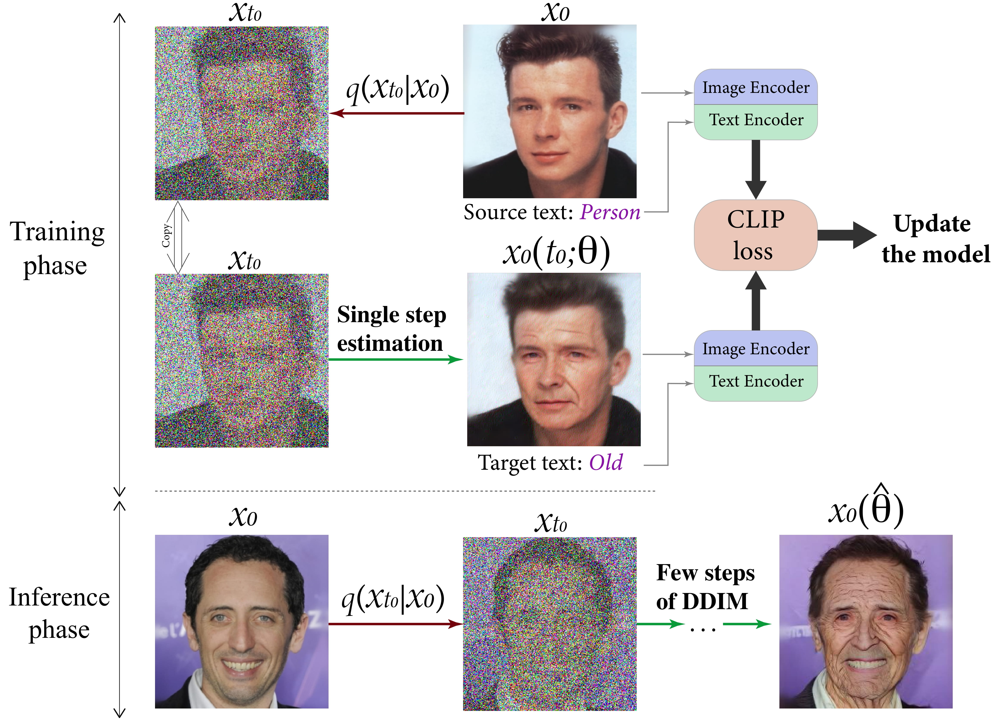

# Towards Real-time Text-driven Image Manipulation with Unconditional Diffusion Models

Official implementation [](https://arxiv.org/abs/2011.13786) by ...

This code based on [DiffusionCLIP](https://github.com/gwang-kim/DiffusionCLIP).

[](https://colab.research.google.com/drive/1rtu01eOB2gwr_j0gSyzXgkbMUKL_mNIx?usp=sharing)



## Overview

This work addresses efficiency of the recent text-driven editing methods based on unconditional diffusion
models and develop a novel algorithm that learns image manipulations 4.5−10× faster and applies them 8× faster.



We provide **two settings** for editing of images

**1.** _Domain adaptation setting_

It firstly fine-tunes diffusion model using set of images (about 50 examples) to learn transformation. 
Then diffusion model applies learned transformation to any image. The entire procedure takes about **45 secs** and **7 GiB** (tested on NVIDIA A100)

**2.** _Single image editing_

Diffusion model fine-tunes using only one image provided by user. And then transforms the image. For new images a new fine-tuning is needed. This setting takes about **4 secs**. 

This work uses diffusion models pretrained on **Celeba-HQ, LSUN-Church, AFHQ-Dog** and **ImageNet** datasets.

## Getting started

### 0. Colab notebook
[](https://colab.research.google.com/drive/1rtu01eOB2gwr_j0gSyzXgkbMUKL_mNIx?usp=sharing)

First of all, try to play with our **colab notebook**. It is single image setting in which you can edit your own images.
### 1. Preparation

* _Install required dependencies_
```
# Clone the repo
!git clone https://github.com/quickjkee/EffDiff

# Install dependencies
!pip install ftfy regex tqdm
!pip install lmdb
!pip install pynvml
!pip install git+https://github.com/openai/CLIP.git

conda install --yes -c pytorch pytorch=1.7.1 torchvision cudatoolkit=<CUDA_VERSION>
```

* _Download pretrained diffusion models_

  * Pretrained diffuson models on CelebA-HQ, LSUN-Church are automatically downloaded in the code.

  * For AFHQ-Dog and ImageNet please download corresponding models: [ImageNET](https://openaipublic.blob.core.windows.net/diffusion/jul-2021/512x512_diffusion.pt), [AFHQ-Dog](https://onedrive.live.com/?authkey=%21AOIJGI8FUQXvFf8&cid=72419B431C262344&id=72419B431C262344%21103832&parId=72419B431C262344%21103807&o=OneUp).
  After downloading put them in ```/pretrained``` folder


* _Download datasets_ (this part can be skipped if you have your own training set, please see the second section for details)
   * For CelebA-HQ and AFHQ-Dog you can use the following code:    
  ```
  # CelebA-HQ 256x256
  bash data_download.sh celeba_hq .
  
  # AFHQ-Dog 256x256
  bash data_download.sh afhq .
  ```
  * For [LSUN-Church](https://www.yf.io/p/lsun) and [ImageNet](https://image-net.org/index.php), you can download them from the linked original sources and put them in `/data/lsun` or `/data/imagenet`.

### 2. Running
First of all, choose the config for insteresting domain: ```celeba/afhq/church/imagenet.yaml```\
Secondly, select editing attribute (the editting attributes for each domain can be found [here](/utils/text_dic.py))\
(note that you can change this file adding your own transformations)\
Finally, check out the descriptions of running options [here](/docs/clip-finetune-help).

Below we provide running commands for different settings:

* _Domain adaptation setting (**dataset training** and **dataset test**)_ \
If you've downloaded specific dataset, then you can fine-tune your model using images from dataset. 
And then apply fine-tuned model to images from a test dataset. \
The following command uses 50 images for train and test on Celeba-HQ:

    ```
  python main.py --clip_finetune      \
               --config celeba.yml      \
               --exp ./runs/test        \
               --edit_attr makeup       \
               --fast_noising_train 1   \
               --fast_noising_test 1    \
               --own_test 0             \
               --own_training 0         \
               --single_image 0         \
               --align_face 0           \
               --n_train_img 50         \
               --n_precomp_img 50       \
               --n_test_img 50          \
               --n_iter 5               \
               --t_0 350                \
               --n_inv_step 40          \
               --n_train_step 6         \
               --n_test_step 6          \
               --lr_clip_finetune 6e-6  \
               --id_loss_w 0.0          \
               --clip_loss_w 3          \
               --l1_loss_w 1.0 
    ```

* _Domain adaptation setting (**dataset training** and **own test**)_ \
If you've downloaded specific dataset, but you want to test learned transformation on your own images
you can change ```--own_test 0``` to ```--own_test all```. Before running put your own images in ```/imgs_for_test``` folder. 
Moreover, you can test learned transformation only on a single image. To this end, change ```--own_test all``` to ```--own_test <your_image_name>```.
  ```
  python main.py --clip_finetune      \
             --config celeba.yml      \
             --exp ./runs/test        \
             --edit_attr makeup       \
             --fast_noising_train 1   \
             --fast_noising_test 1    \
             --own_test all           \
             --own_training 0         \
             --single_image 0         \
             --align_face 0           \
             --n_train_img 50         \
             --n_precomp_img 50       \
             --n_test_img 50          \
             --n_iter 5               \
             --t_0 350                \
             --n_inv_step 40          \
             --n_train_step 6         \
             --n_test_step 6          \
             --lr_clip_finetune 6e-6  \
             --id_loss_w 0.0          \
             --clip_loss_w 3          \
             --l1_loss_w 1.0 
  ```
  
* _Domain adaptation setting (**own training** and **own test**)_\
  If you want to fine-tune a diffusion model using your own images, then simply put them in ```/imgs_for_train``` folder
  and change ```--own_training 0``` to ```--own_training 1```. Thus, here you do not need to download datasets.
  ```
  python main.py --clip_finetune      \
             --config celeba.yml      \
             --exp ./runs/test        \
             --edit_attr makeup       \
             --fast_noising_train 1   \
             --fast_noising_test 1    \
             --own_test all           \
             --own_training 1         \
             --single_image 0         \
             --align_face 0           \
             --n_train_img 50         \
             --n_precomp_img 50       \
             --n_test_img 50          \
             --n_iter 5               \
             --t_0 350                \
             --n_inv_step 40          \
             --n_train_step 6         \
             --n_test_step 6          \
             --lr_clip_finetune 6e-6  \
             --id_loss_w 0.0          \
             --clip_loss_w 3          \
             --l1_loss_w 1.0 
  ```

* _Single image setting (**own image**)_\
  To apply single image editing to your own image, firstly change ```--single_image 0``` to ```--single_image 1```. 
  Then put the image in ```/imgs_for_test``` and fill ```--own_test <your_image_name>```. For instance, ```--own_test girl.png``` as follows:
  ```
  python main.py --clip_finetune        \
               --config celeba.yml      \
               --exp ./runs/test        \
               --edit_attr makeup       \
               --fast_noising_train 1   \
               --fast_noising_test 1    \
               --own_test girl.png      \
               --own_training 1         \
               --single_image 1         \
               --align_face 1           \
               --n_train_img 1          \
               --n_precomp_img 1        \
               --n_test_img 1           \
               --n_iter 5               \
               --t_0 350                \
               --n_inv_step 40          \
               --n_train_step 6         \
               --n_test_step 6          \
               --lr_clip_finetune 6e-6  \
               --id_loss_w 0.0          \
               --clip_loss_w 3          \
               --l1_loss_w 1.0 
  ```